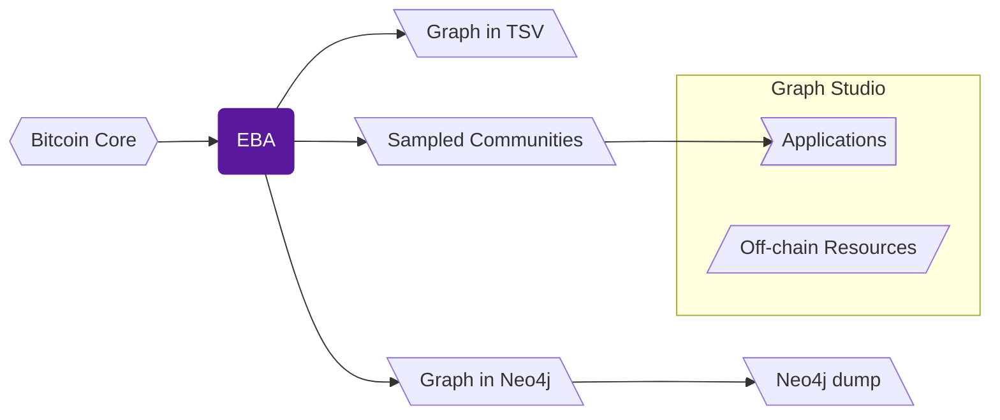

EBA interfaces with the Bitcoin network and 
creates a graph of the full history of transactions recorded on-chain, 
encompassing the complete trading details of over 8.72 billion BTC.
The temporal heterogeneous graph consists of over 2.4 billion nodes and 
39.72 billion time-stamped edges spanning more than a decade, 
making it a complete resource for developing models on Bitcoin and 
a large-scale resource for benchmarking graph neural networks. 

We share the complete ETL pipeline and all the data it generates. 
To simplify working with the pipeline and its resources, 
we have split them into separate repositories. 
The following resource map will help you navigate to the resources that suit your application. 
See this page for details.

Here you'll find [end-to-end examples](#implemented-solutions) for working with this graph, 
plus [guidelines](#designing--evaluating-models-on-the-bitcoin-graph) to help you build models on your own applications.

## Implemented Solutions

* [**_Hello World_ Script Classification.**](/quickstart/script_classification)
    Demonstrates loading data, 
    training a script classification model based on 
    embeddings of a root node in a sampled community, 
    evaluating its performance, 
    and exploring related external annotations.

## Designing & Evaluating Models on the Bitcoin Graph

Building models on this graph is goal-driven; there is no single "best" recipe. 
You may use the guidance below to align node or edge features, sampled communities,
training, and evaluation with your specific application.

### Define the objective and choose features accordingly

* **BlockHeight (time):**

    Note that Bitcoin does not have a central clock; 
    however, each block contains a [median time](https://en.bitcoin.it/wiki/BIP_0113) included by the miner. 
    You may use this median time (timestamp) or the block height 
    (a continuously increasing integer). 
    Depending on which feature you use, 
    you may need to implement specific normalization or feature engineering strategies 
    (e.g., sin/cos for cyclic time). 

* **Skewed Magnitudes: BTC Value and In/Out-Degrees:**

    The dataset covers Bitcoin's entire history. 
    The value of BTC and the amount traded per block 
    have changed significantly from the network's early days to the present.

    Similarly, Bitcoin's usage patterns have also shifted, 
    which for various reasons (discussed in the paper) 
    can significantly impact the in/out-degrees of nodes 
    in the sampled communities.

    You may normalize these features 
    (perhaps applying `log1p` before normalization) 
    or work with the raw values, depending on your training and application objective. 
    We suggest you thoroughly study the value distributions in your communities 
    before choosing an approach; for instance, this may be less of a concern 
    if you are only working with communities from recent blocks.

### Understand on-chain data realities

*   Remember that this is **on-chain data**, 
    which is not a complete record of every transaction. 
    Exchanges, for instance, aggregate many internal, 
    off-chain user transfers into fewer, 
    on-chain transactions to save on fees. 
    Generally, with transactions submitted by exchanges, 
    the addresses recorded in the on-chain transactions 
    often belong to the services themselves, not to individuals. 
    A single on-chain edge may therefore summarize many latent events.

### Practical Checklist

*   **Stability:** 
    Some features, such as the `value` of an edge, 
    are measured in BTC and can be as small as `1e-8`. 
    Therefore, it's recommended to start with FP32 (no AMP), 
    guard divisions with a small epsilon, 
    and add AMP only after the loss and metrics are stable.
